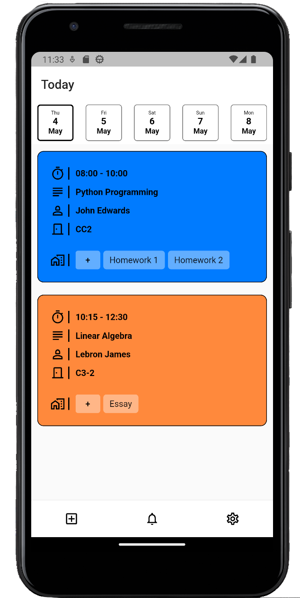
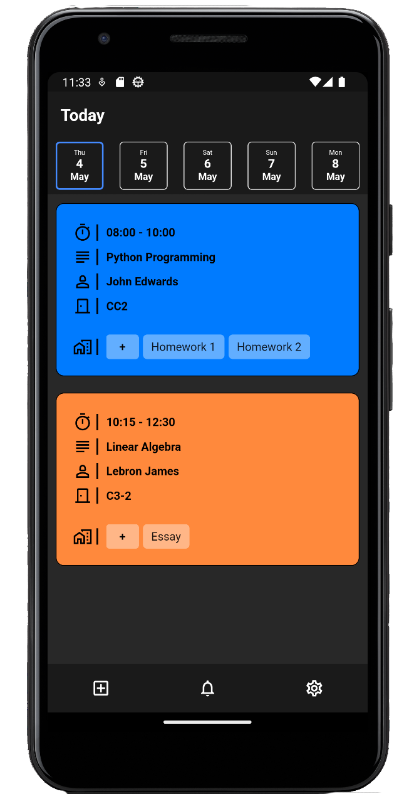
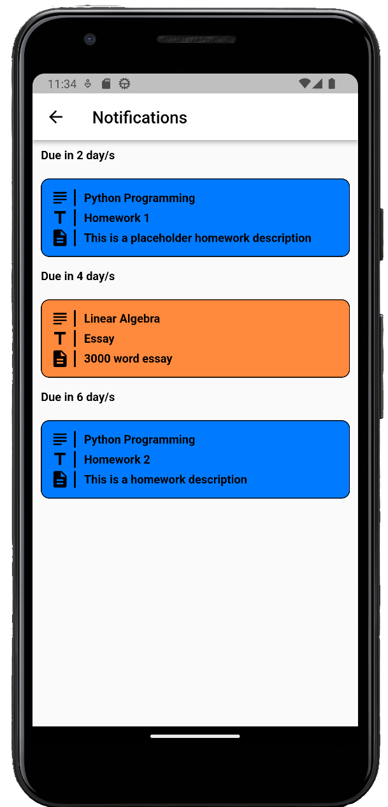
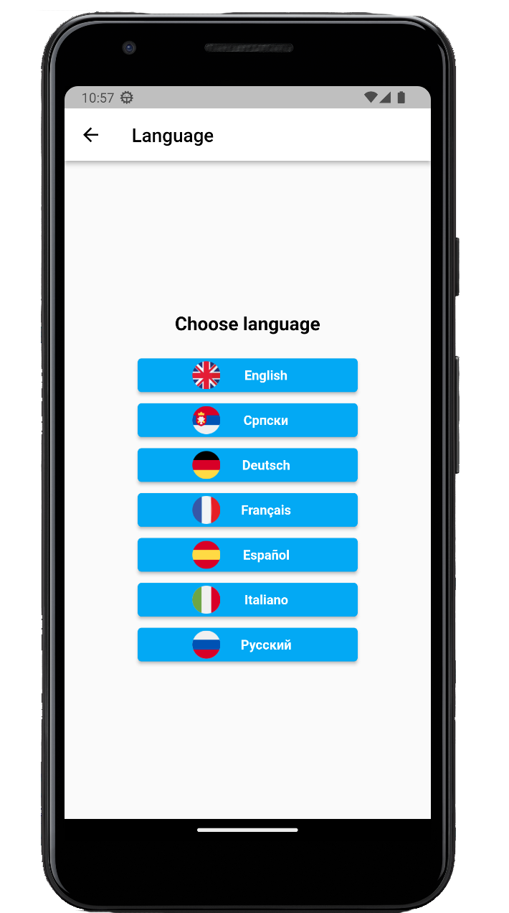

#Class Schedule App

This is an mobile app to help students organize their classes and homework's in school/university. For now it is only available on Android
but i hope that in the near future i will release it on IOS too.

I used BloC as a design pattern and as a state management. This is my pilot project and i was still learning Flutter as i was
developing it so you might see some things that are unconventional for BloC design pattern. When i have free time i will
fix all the things that need fixing.

In this app i implemented local storage, In-app purchases, notifications and for that i used SQFLite package for writing to local storage,
official IAP package for implementing in app purchases and for notifications i used flutter local notifications package.

#The app

#Main Screen

On the main screen you can switch between days of the week and it will show you classes you have for that day. You also have the
option to add multiple weeks, so if you have schedule that changes every other week you can set that up too.

#Dark Mode

#Notifications Screen

On this screen you have an overview of your upcoming homeworks. You will also receive notifications the day before due date to alert you of your unfinished homework.

#Localization

I also added 7 different languages you can choose and it changes in real time you don't have to restart the app to apply changes.

